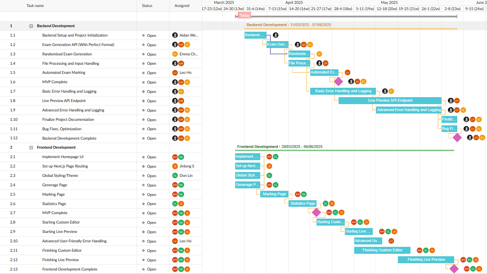

# 📝 Shuffle

## 📋 Project Management



Note: Due to our GanttPRO trial expiring before final submission, we are unable to provide a live link to the full interactive chart. However, the timeline above closely reflects the actual schedule and key milestones we followed throughout the project.

## 📖 Project Overview
Shuffle is a web-based exam generation and marking tool designed to automate the process of creating, and grading multiple-choice university exams. It generates multiple shuffled versions of an exam, handles answer sheet parsing, and allows instructors to manually adjust results with real-time feedback. 

Final report [Check out here](https://docs.google.com/document/d/1leis4u9QUf2fEuT3ul9U0WmjSpv2unkTgV4Fq40W3lc/edit?usp=sharing)

## 🛠️ Technologies
| Component      | Tech & Version                          |
| -------------- | --------------------------------------- |
| **Backend**    | Node.js v20, Express v5, TypeScript v5.8 |
| **Frontend**   | Next.js v15, React v19, TailwindCSS v4   |
| **PDF Gen**    | libreoffice-convert v1.6, docx v9.5      |
| **Container**  | Docker, Docker Compose v2               |

## 🌐 Live Deployment
The project is currently hosted at: **http://school.anthony-sh.co.nz**

## ⚙️ Installation & Setup

### Clone the repo
```bash
git clone https://github.com/uoa-compsci399-2025-s1/capstone-project-2025-s1-team-1.git
cd capstone-project-2025-s1-team-1
```

### Dev (recommended)
Run your app in development mode with live reload:

**First time:**
```bash
docker compose up --build
```

**Subsequent runs:**
```bash
docker compose up
```

### Production

First checkout the production branch:
```bash
git checkout -b production/v1
cd capstone-project-2025-s1-team-1
```

Build and start all services for production:

**First time:**
```bash
docker compose -f docker-compose.prod.yml up --build
```

**Subsequent runs:**
```bash
docker compose -f docker-compose.prod.yml up
```

## 💻 Usage Examples
Check out the demo:  
[](https://www.youtube.com/watch?v=VQUk5Eiw33E&ab_channel=EmmaChen)


## 🚀 Future Plans

Our platform now meets all core client requirements and provides a robust, extensible foundation for digital exam creation and marking at the university. Looking ahead, there are several promising directions for further enhancement that will add even more value for lecturers and the wider academic community.

**Integrations:**  
One impactful avenue for future improvement is integration with existing university systems such as Canvas. This would streamline the workflow for lecturers by enabling direct export of marked grades and exam data, reducing manual effort and ensuring greater data consistency across platforms.

**Support for Additional Input Formats:**  
To make the platform even more versatile, we are considering support for additional file formats such as LaTeX. This would enable more seamless inclusion of mathematical notation, scientific formulas, images, and tables—helping the system better serve departments like Mathematics and Physics.

**Accessibility & UX Enhancements:**  
We are committed to ongoing improvements in accessibility and user experience. Planned features include options for light and dark modes, larger text, screen reader compatibility, and enhanced filtering and analytics for deeper insights into student performance.

With these future enhancements, our platform is well positioned to continue evolving, enhancing exam creation and marking experience that adapts to the changing needs of staff and students.
